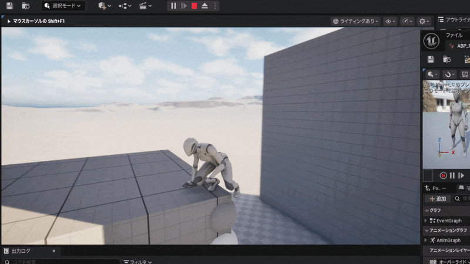

# MyUE1stGame

Unreal Engine 5 / C++で制作した個人製作の3Dアクションゲームです。

## Play Demo

  

## 概要

ポイントへ高速で移動し、着地後に次のポイントへ飛び出す
「Point Jump」アクションを中心に制作しています。

## 主な実装

- カメラ方向・距離を利用したPoint Jumpターゲットの選択
- 壁越しのターゲットを除外する判定
- Point Jumpの状態遷移管理
- PointJumpActionComponentへの処理分割
- Enhanced Inputによる入力処理
- マウスによるカメラ操作

## 開発環境

- Unreal Engine 5
- C++
- Blueprint
- Enhanced Input

## 共通略称

- `IA_` = Input Action
- `IMC_` = Input Mapping Context
